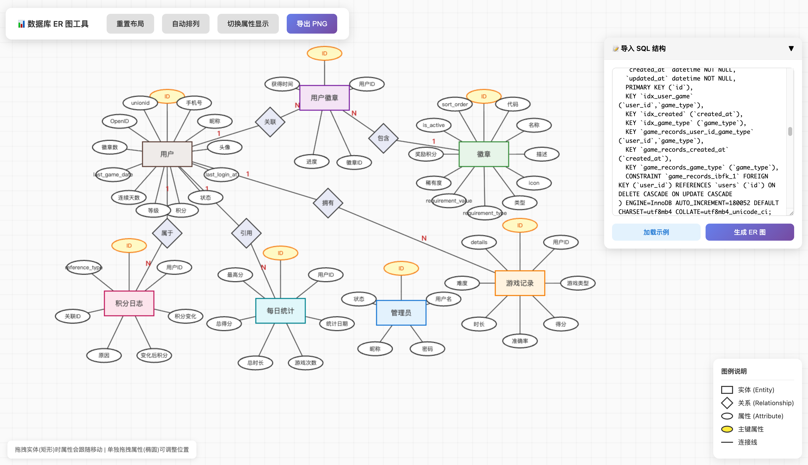

# Schema2ER

### 写论文的宝子们  ER图是不是画得脑瓜疼？

> 🎨 SQL 数据库结构一键转换为经典 Chen 记法 ER 图，> 适合论文、教学、技术文档

## ✨ 特性

- 📥 **SQL 导入** - 粘贴 CREATE TABLE 语句，自动生成 ER 图
- 🎯 **Chen 记法** - 经典的实体-关系-属性图形表示
- 🖱️ **拖拽调整** - 自由拖拽实体、关系、属性
- 📐 **智能布局** - 一键自动排列，网格布局
- 🖼️ **PNG 导出** - 导出高清图片，用于文档
- 🇨🇳 **中文友好** - 自动翻译常用字段名

## 🚀 使用方法

1. 无需打开 `index.html`
2. 粘贴 SQL 建表语句到右侧输入框
3. 点击「生成 ER 图」
4. 拖拽调整位置
5. 点击「导出 PNG」

## 📖 图例说明

| 图形 | 含义 |
|------|------|
| 矩形 | 实体 (Entity) |
| 菱形 | 关系 (Relationship) |
| 椭圆 | 属性 (Attribute) |
| 黄色椭圆 | 主键 (Primary Key) |
| 1:N / N:1 | 基数关系 |

## 🛠️ 技术栈

- 纯原生 HTML/CSS/JavaScript
- Canvas 2D 绑定
- 无依赖，单文件运行

## 📝 支持的数据库

- MySQL
- MariaDB
- 其他兼容 SQL 语法的数据库

## 🤝 贡献

欢迎提交 Issue 和 Pull Request！

## 📄 许可证

MIT License

---

## ☕ 请作者喝杯咖啡

如果这个项目对你有帮助，欢迎请我喝杯咖啡 ☕

 

> 开源不易，感谢支持 ❤️
